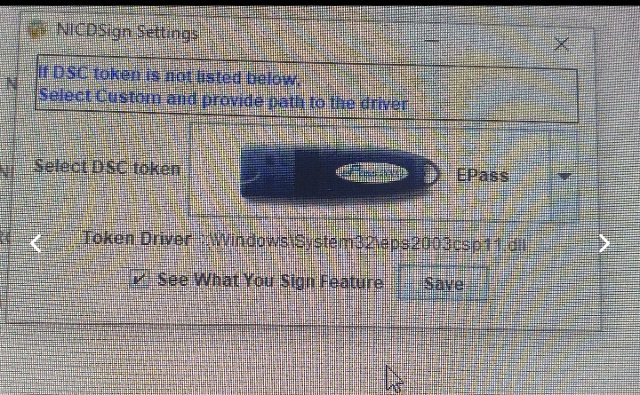

# DSC Issues

### Add DSC token driver in NICDSign(for BIMS/SPARK)

Right-click on the Rubix cube and select Settings and select the correct dsc token `(proxkey / epass )`


For **epass,** select `custom`---> Then click on the `browse file` below. ** `C: \ Windows \ System32 \eps2003csp11.dll`** and **save**


&#x20; **Just save to Proxkey.**


When you save it you will be asked to re-insert the token. When done, the dsc token and signer are ready.

