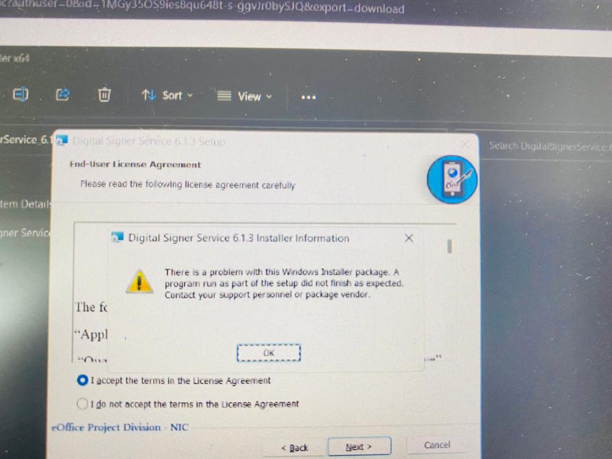

# e-0ffice Issues

## eOffice DSC Signer Installation Error\[Windows]

<figure><figcaption></figcaption></figure>

```
C Drive --->Windows --->System32 --->Drivers --->etc --->Hosts
```



### Right Click on hosts file





### Select Properies





### Untick Read-Only





### Then Click on Apply





### Reinstall DSC Signer Service




