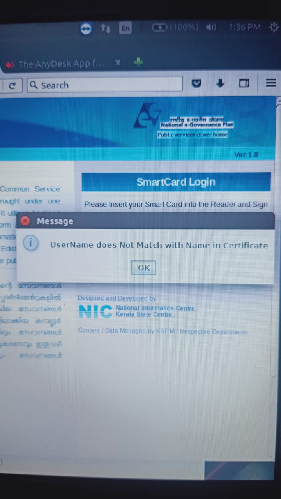

# e-District Issues

## User name doesnot match with name in certificate

> solution

> Step1:

> `Administration -->Users -->Digital Signature-->Login Name-->Delete`(click delete option)
>
> ****:white\_check\_mark: **ഡിജിറ്റൽ സിഗ്നേച്ചർലെ നെയിമും,സർട്ടിഫിക്കറ്റിലെ(Full Name of User in English) നെയിമും ഒന്നാണോ എന്ന് പരിശോധിക്കുക.വ്യത്യാസം ഉണ്ടെങ്കിൽ ഡിജിറ്റൽ സിഗ്നേച്ചർ ലെ പോലെ തന്നെ സർട്ടിഫിക്കറ്റിലും കൊടുക്കുക.**
>
> Step2:
>
> `Administration-->Users-->Create-->Login Name(Type Login Name enter tab)--->Click Edit User`

