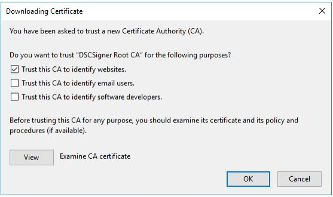
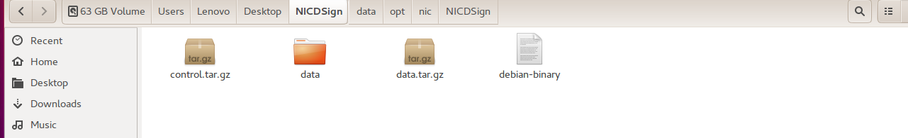
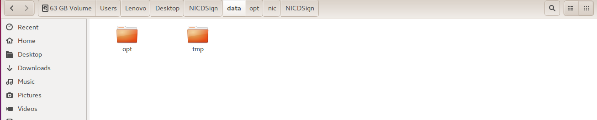
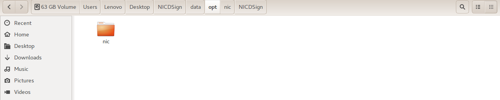
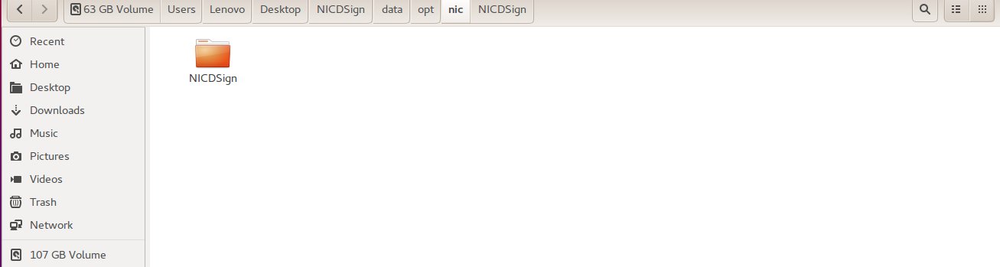
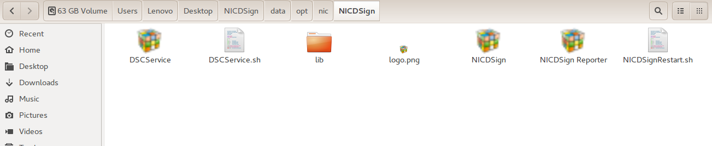

# NICDSign Issues

## How to Uninstall Previous Version of NICDSign

```
sudo dpkg --purge dscsigner
```

## Browser configuration

**Google Chrome  **

```
chrome://flags/#allow-insecure-localhost
```

**Mozilla Firefox**

```
about:preferences#privacy
```

**Certificate section** and click on the **View Certificates** button to open the certificate manager.In the Certificate Manager popup, click on the **Authorities **tab and then click on **Import button.**Browse to DSCSigner/ssl folder and select the** **[**rootCA.crt**](https://bims.treasury.kerala.gov.in/treasury/dsc/rootCA.crt) file and click on the Open button



:white\_check\_mark: The configuration is complete and now you can use Mozilla Firefox for digital signing using DSCSigner.

## **How to Fix NICDSign Installation Error**

 (1).jpg>)

> solution: Go to Downloads folder and extract NICDSign.deb file



> Then Extract `data.tar.gz`



> Then Go to `opt` folder



> Then Go to `nic` folder



> Then Go to `NICDSign` folder



> Then copy paste `NICDSign.desktop` file to `Desktop`

> After completing this process, run NICDSign.deb file again _(sudo dpkg -i NICDsign.deb)_

> :white\_check\_mark: NICDSign installed Successfully&#x20;

**Enable NICDSign **

```
sudo mkdir /home/user/.config/autostart
```

```
cd /home/user/.config/autostart
```

```
sudo cp /opt/nic/NICDSign/DSCService.desktop /home/user/.config/autostart
```

```
cd /home/device_name/.config/autostart
```
