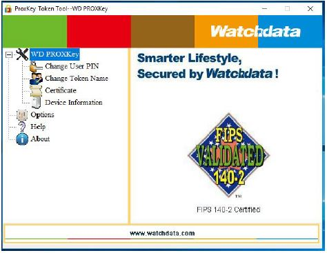
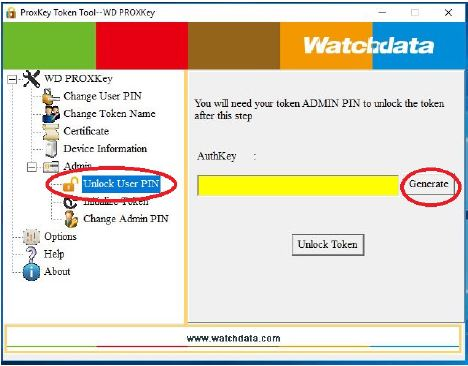
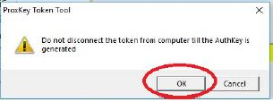
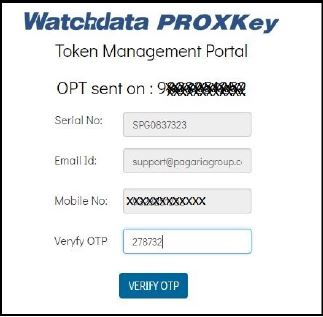
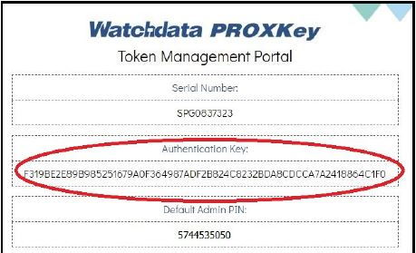
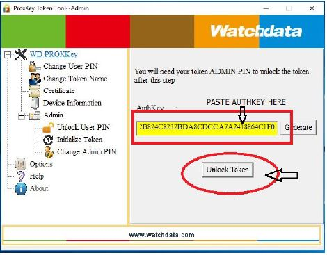
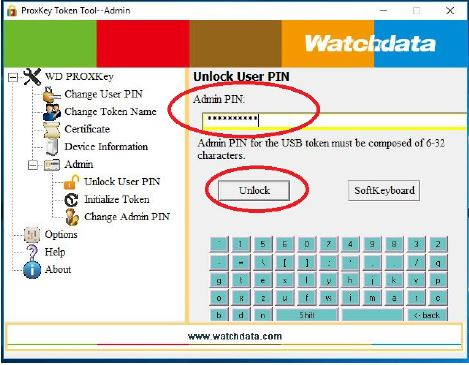
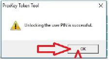
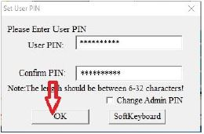
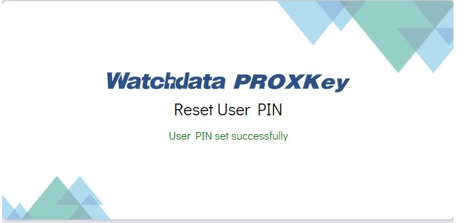

# 3. 🔐 Digital signature

## Digital Signature Driver Software


* DSC Token Driver(NICDSign)
* TRUSTKEY
* PROXKey:

&#x20;                    I)Proxkey PRO

&#x20;                    II)Capricorn

* ePass


## TRACK DSC STATUS





## Cash Solution Software




## Download Token Driver




## &#x20;**Remove Token Drivers**



```
sudo apt-get purge wdtokentool-proxkey
```

```
 cd /usr/lib/WatchData/ProxKey
```

```
sudo ./uninstall 
```



```
cd /usr/lib/WatchData/TRUSTKEY
```

```
sudo ./uninstall 
```





```
cd /usr/lib/WatchData/eMudhra_3.4.3
```

```
sudo ./uninstall
```





## DSC View Certificate



```
sudo watchsafe_TRUSTKEY
```





```
sudo watchsafe_emudhra_3.4.3
```



```
sudo pkimanager_admin
```



## Reset ProxKey USER PIN -Proxkey

[Token Unlock](https://manage.cryptoplanet.in/en/):person\_raising\_hand:

Pre Prerequisites for Reset USER PIN

Token must be registered either by following methods

1. **PIN Mode Registration** – Validate Token User PIN (Register token at the time of purchase)
2. **KYC Mode Registration** – Validate Certificate KYC (Use this when token USER PIN is not know)
3. **Manual Mode Registration** – Validate ID Proof & submit application form

## Steps to Reset Token USER PIN

1. Install the token middle ware / driver([visit here](http://www.e-mudhra.com/Repository/index.html))
2. Locate “WD ProxKey” Icon on the desktop and double click on it to open the Token Management Utility
3. Token middle ware interface will open



4.Press `Ctrl + Alt + W` to see the Admin menu & click on ‘Unlock User PIN’. You will require to generate an ‘AUTHENTICATION KEY’ . Click on ‘GENERATE



You will get a prompt. DO NOT DISCONNECT TOKEN till authentication key is generated. Click on OK



You will be redirected to website to Authenticate using OTP on mobile number used while Token Registration. Enter the OTP received on mobile and click on ‘VERIFY OTP



You will be displayed your SERIAL NUMBER, AUTHENTICATION KEY & DEFAULT ADMIN PIN. Copy the AUTHENTICATION KEY



Paste the key in the token middleware and click on Unlock



Enter the default admin pin of the token or use your changed admin pin (In case you have changed your admin pin)



RESET OF USER PIN is successful



Enter your new USER PIN and click OK




