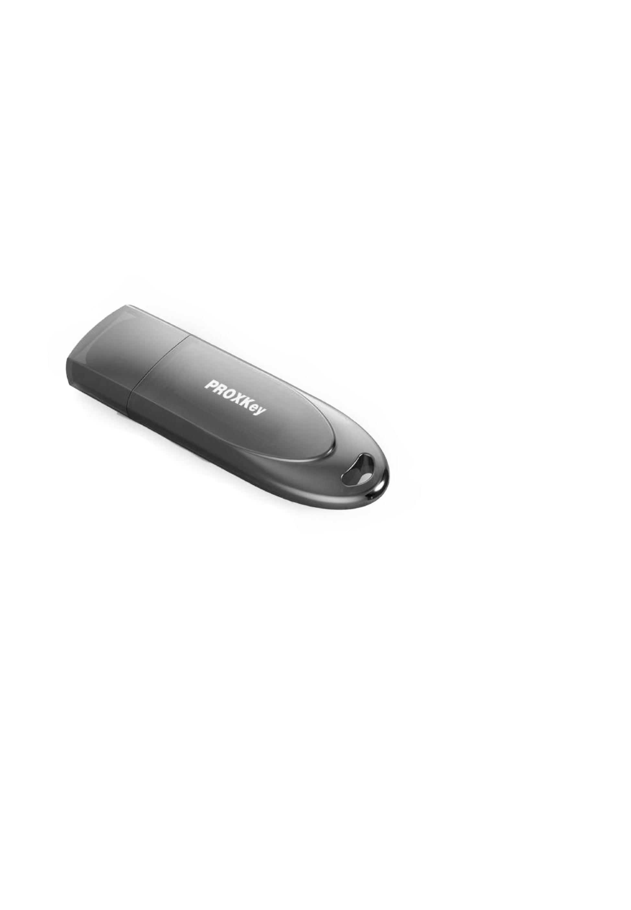

# 🔐 Digital signature

## Digital Signature Driver Software


* DSC Token Driver\(NICDSign\)
* TRUSTKEY
* PROXKey
* ePass


#### TRACK DSC STATUS






 **Remove Token Drivers**



```text
sudo apt-get purge wdtokentool-proxkey
```







## DSC View Certificate



```text
sudo watchsafe_TRUSTKEY
```


## PROXKey WATCHDATA





```text
sudo watchsafe_emudhra_3.4.3
```



```text
sudo pkimanager_admin
```



