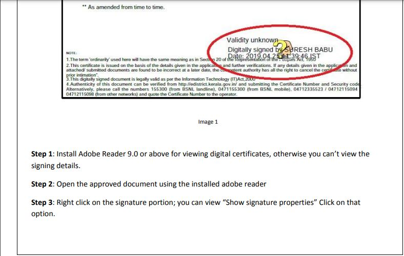
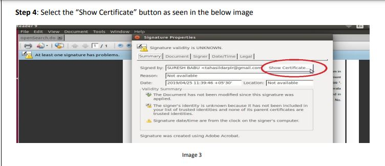
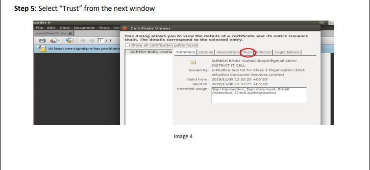
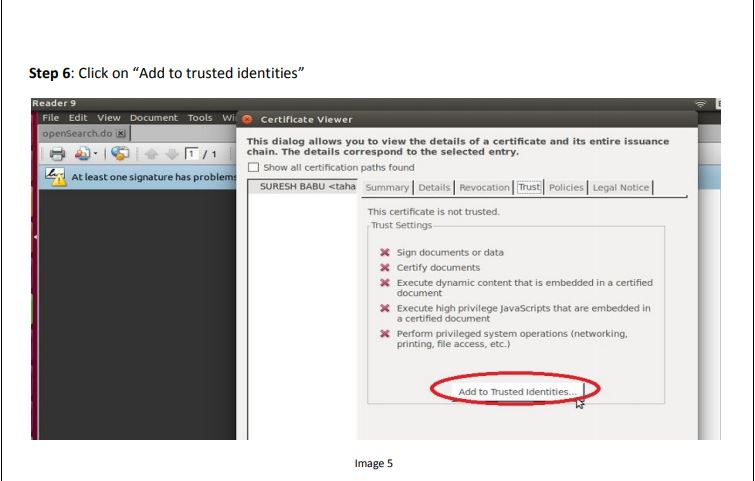
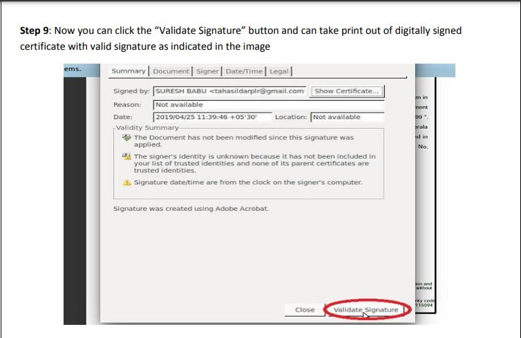
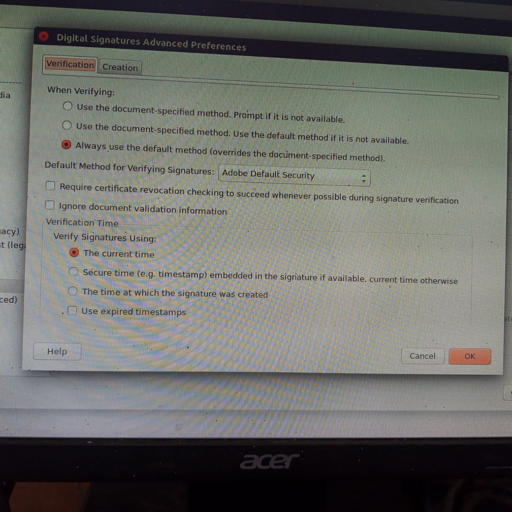

# PDF


## \*\*\*\*

## Installation of Adobe Reader in Ubuntu 20

```text
sudo wget -O ~/adobe.deb ftp://ftp.adobe.com/pub/adobe/reader/unix/9.x/9.5.5/enu/AdbeRdr9.5.5-1_i386linux_enu.deb
```

```text
sudo dpkg --add-architecture i386
```

```text
sudo apt update
```

```text
sudo apt install libxml2:i386 libcanberra-gtk-module:i386 gtk2-engines-murrine:i386 libatk-adaptor:i386
```

```text
sudo dpkg -i ~/adobe.deb
```


Launch Adobe Acrobat Reader on Ubuntu 20.04


## **How to Set Adobe Reader as default PDF reader**

> Run command below in terminal to edit the`config` file:

```text
sudo gedit /etc/gnome/defaults.list
```

> When the file opens, do: Find out and change the line

`application/pdf=evince.desktop`

> into:

```text
application/pdf=acroread.desktop
```

> Add below line into the end:

```text
application/fdf=acroread.desktop
application/xdp=acroread.desktop
application/xfdf=acroread.desktop
application/pdx=acroread.desktop
```

> ✅ Finally save the file and restart nautilus \(run command nautilus -q in terminal\) to apply changes.

## Signature Validation














**Signature Validation Completed !**


## Can't validate signature on PDF \[SSL Error\]

* [x] In Acrobat or Reader, click `Edit` &gt; `Preferences`.
* [x] From the `Preferences` dialog box, select `Security` on the left.
* [x] Click `Advanced Preferences`, and then click the `Verification tab`.
* [x] Select Verify Signature using `'The Current time'`




Restart the pdf and validate the signature


