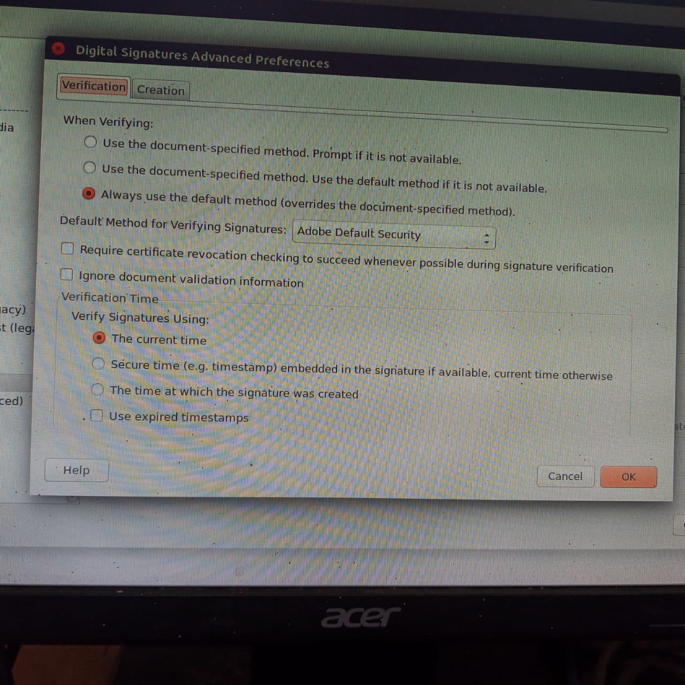
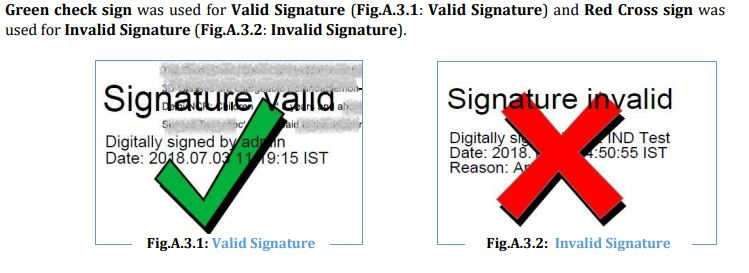
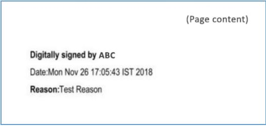
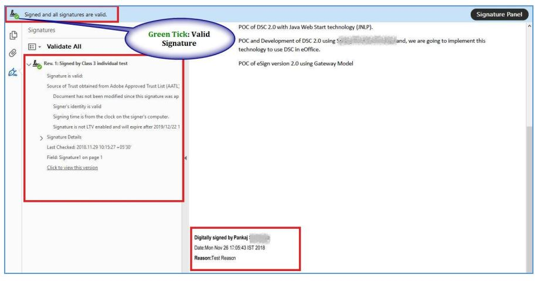
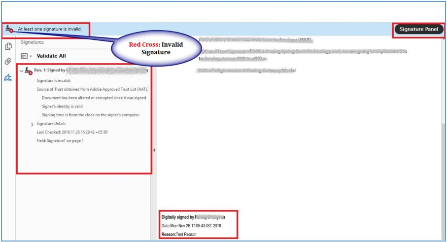

# PDF



<mark style="color:red;">**Please note that Adobe no longer supports Acrobat Reader for Linux. The latest native Linux version is 9.5.5 dated from 26/04/2013. From this reason you should refrain using/installing Adobe Acrobat Reader to avoid potential vulnerabilities and hacker exploits.**</mark>


## Installation of Adobe Reader in Ubuntu&#x20;

```
sudo wget -O ~/adobe.deb ftp://ftp.adobe.com/pub/adobe/reader/unix/9.x/9.5.5/enu/AdbeRdr9.5.5-1_i386linux_enu.deb
```

```
sudo dpkg --add-architecture i386
```

```
sudo apt update
```

```
sudo apt install libxml2:i386 libcanberra-gtk-module:i386 gtk2-engines-murrine:i386 libatk-adaptor:i386
```

```
sudo dpkg -i ~/adobe.deb
```


Launch Adobe Acrobat Reader on Ubuntu


## How to Remove Adobe Reader in Ubuntu

```
sudo apt-get purge adobereader-enu
```

```
sudo apt-get autoremove
```

## **How to Set Adobe Reader as default PDF reader**

_Ubuntu 32 bit_

```
sudo gedit /usr/share/applications/AdobeReader.desktop
```


**Edit the Exec=acroread line to be Exec=acroread %f and save the file.**


_Ubuntu 64 bit_

```
sudo gedit /usr/share/applications/AdobeReader.desktop
```


**Edit the Exec=acroread line to be Exec=acroread %f and save the file.**


## Can't validate signature on PDF \[SSL Error]

* [x] In Acrobat or Reader, click `Edit` > `Preferences`.
* [x] From the `Preferences` dialog box, select `Security` on the left.
* [x] Click `Advanced Preferences`, and then click the `Verification tab`.
* [x] Select Verify Signature using `'The Current time'`




Restart the Adobe reader and validate the signature


### Display of Valid Signature in previous version of Digital Signature:



### Display of Valid Signature in Current Version of Digital Signature:



### Digital Signature Validation:


After opening the pdf file, click on Signature Panel located at upper right corner of adobe reader. A window will open on left side of document, where all information regarding signature validation is displayed along with the signature details. In case of Valid signature, Green Check will be shown at upper left corner of adobe reader and also inside signature panel itself





In case of Invalid Signature, Red Cross sign is displayed at upper left corner of adobe reader and inside signature panel itself,




##
