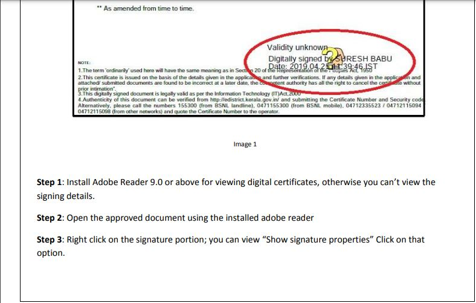
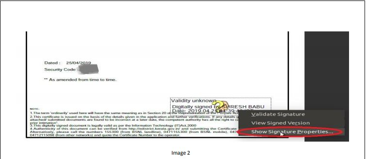
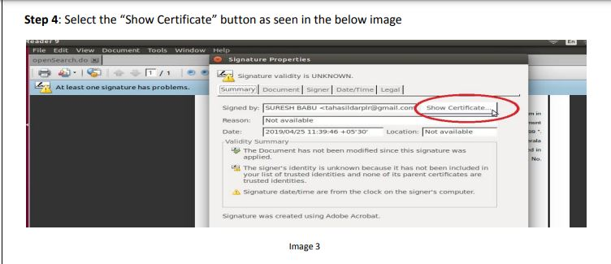
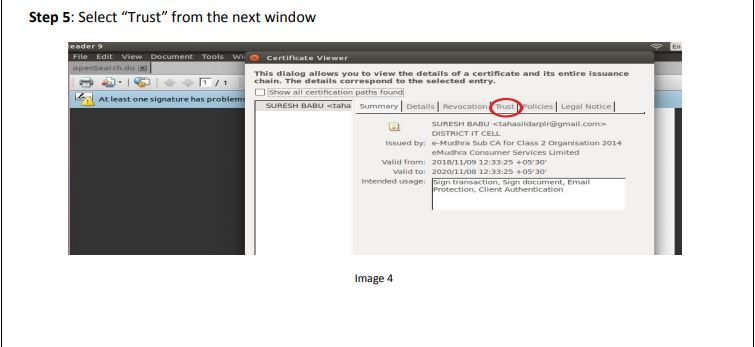
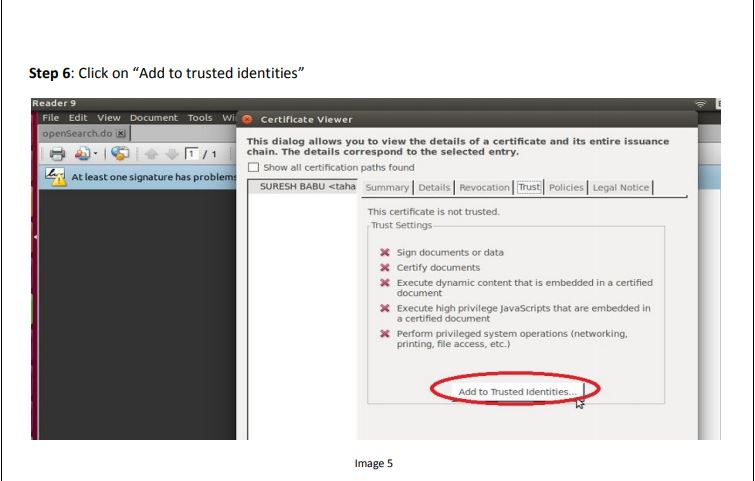
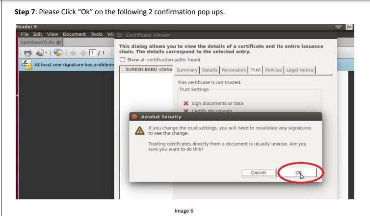
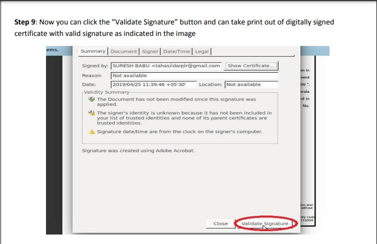

# PDF


## ****

## Installation of Adobe Reader in Ubuntu&#x20;

```
sudo wget -O ~/adobe.deb ftp://ftp.adobe.com/pub/adobe/reader/unix/9.x/9.5.5/enu/AdbeRdr9.5.5-1_i386linux_enu.deb
```

```
sudo dpkg --add-architecture i386
```

```
sudo apt update
```

```
sudo apt install libxml2:i386 libcanberra-gtk-module:i386 gtk2-engines-murrine:i386 libatk-adaptor:i386
```

```
sudo dpkg -i ~/adobe.deb
```


Launch Adobe Acrobat Reader on Ubuntu 20.04


## How to Remove Adobe Reader in Ubuntu

```
sudo apt-get purge adobereader-enu
```

```
sudo apt-get autoremove
```

## **How to Set Adobe Reader as default PDF reader**

_Ubuntu 32 bit_

```
sudo gedit /usr/share/applications/AdobeReader.desktop
```


**Edit the Exec=acroread line to be Exec=acroread %f and save the file.**


_Ubuntu 64 bit_

```
sudo gedit /usr/share/applications/AdobeReader.desktop
```


**Edit the Exec=acroread line to be Exec=acroread %f and save the file.**


## Signature Validation
















**Signature Validation Completed !**


## Can't validate signature on PDF \[SSL Error]

* [x] In Acrobat or Reader, click `Edit` > `Preferences`.
* [x] From the `Preferences` dialog box, select `Security` on the left.
* [x] Click `Advanced Preferences`, and then click the `Verification tab`.
* [x] Select Verify Signature using` 'The Current time'`



Restart the Adobe reader and validate the signature


## OPEN SOURCE  DOCUMENT VIEWER

1. Okular
2. SumatraPDF
3. Libreoffice
4. Evince
