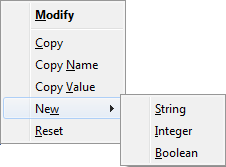
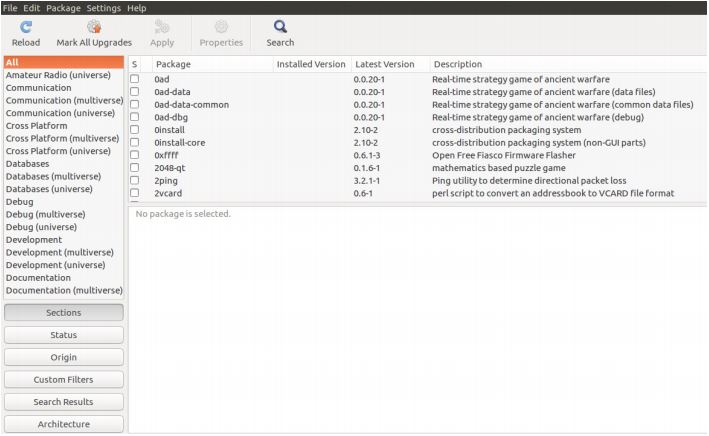
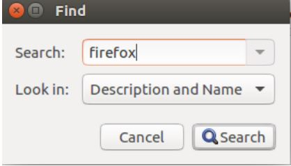
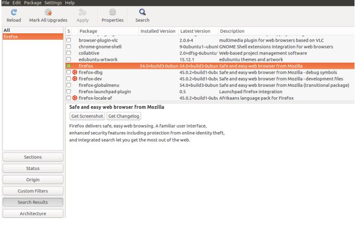
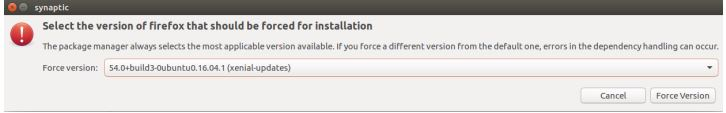
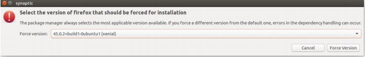
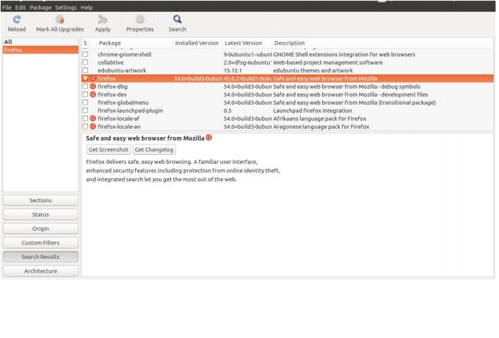
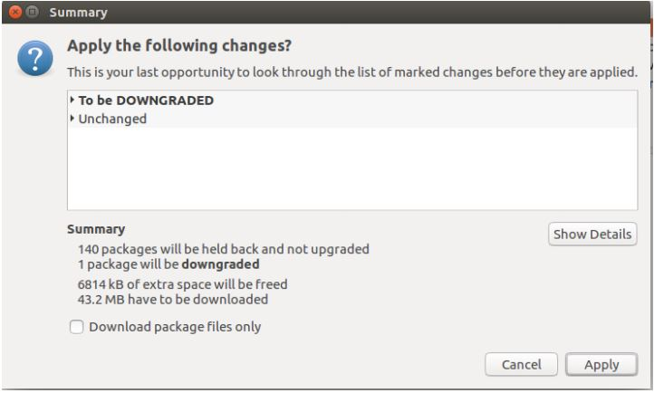

# Firefox Ubuntu


_The latest Firefox  version  is_ <mark style="background-color:green;">**96.0.3**</mark>

## Enable java plugin in firefox 53.0 version

```
about:config
```

> _**`about:config` -> `accept` -> `add new`-> `boolean` -> `plugin.load_flash_only` -> `false`-> `ok`**_&#x20;




```
plugin.load_flash_only 
```

## How to Downgrade the Firefox Version

* Follow the steps carefully.

1. Download Synaptic Package Manager if not already installed

```
sudo apt-get -y install synaptic
```

2\. Open Synaptic either in terminal by

```
sudo synaptic
```

> or from Dash Home.



3\. Click the Search icon in the top center

4\. Type `firefox` and click Search



5\. Select the package highlighted in the image below. No need of selecting other packages



> 6\. In Menu bar, **select Package>Force Version**. Or simply press `Ctrl+E`. A window will appear



> 7\. Select the version to which Firefox is to be downgraded. It’s probably 45.0.2



> 8\. Click on `Force Version`. After that, the window will be like the following image.



> 9\. **Click Apply** on top center, then the following window appears. **Click Apply.**



> 10\. The older version of firefox will be downloaded and installed by itself. Please wait until it’s done. After it’s Completed, again select firefox and go to `Package>Lock Version` to **lock the version of `Firefox to 45.0.2`**. Also run `sudo apt-mark hold firefox` in terminal to ensure the package firefox is locked from further updation.

```
 sudo apt-mark hold firefox
```


successfully downgrade firefox on your system


## Upgrade Firefox in Ubuntu

```
sudo apt-get update
```

```
sudo apt-get install --only-upgrade firefox
```
