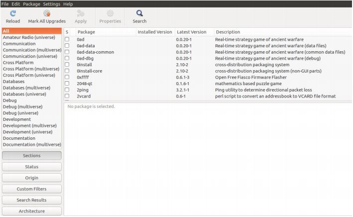
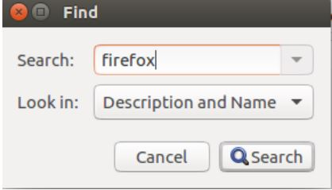
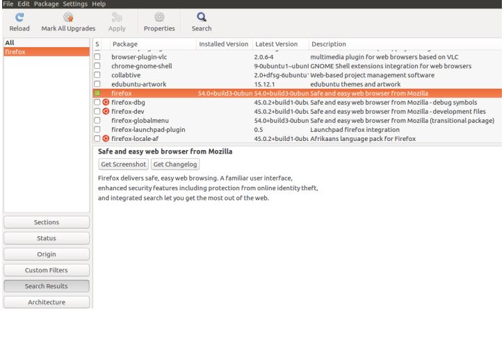
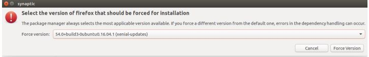
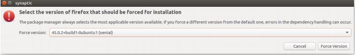
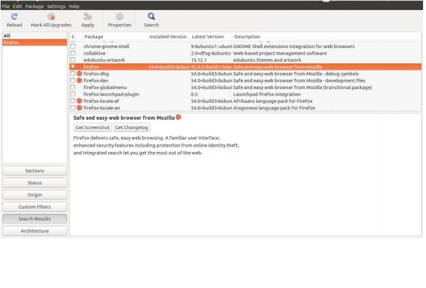
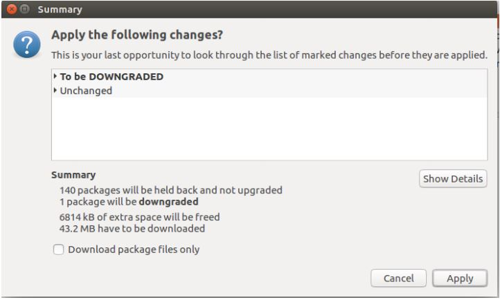

# Firefox Ubuntu

## 1.ഉബുണ്ടു സിസ്റ്റത്തിൽ firefox ഇൻസ്റ്റാൾ ചെയ്യാം


 👮 Most villages use firefox 50 and below versions .. We can enable java plugin up to firefox 53.0 ..Google Drive & whatsapp web will all work in firefox 53 ...  Avoid firefox below 52



## Enable java plugin in firefox 53.0 version

> _**`about:config` -&gt; `accept` -&gt; `add new`-&gt; `boolean` -&gt; `plugin.load_flash_only` -&gt; `false`-&gt; `ok`**_


```text
plugin.load_flash_only 
```

 \#2.firefox ഡൗൺലോഡ് ചെയ്തതിന്‌ ശേഷം ,ഡൗൺലോഡ് ചെയ്ത path ടെർമിനലിൽ ഓപ്പൺ ചെയുക. sh ഫയൽ ആണെങ്കിൽ താഴെ കാണുന്ന കോഡ് ടൈപ്പ് ചെയ്യുക.deb ഫയൽ ആണെങ്കിൽ Gdebi package ഉപയോഗിച്ചോ , [**sudo dpkg -i file name**](ubuntu-package-installation.md) command ഉപയോഗിക്കം

## firefox version അറിയാൻ ടെർമിനലിൽ ഈ കോഡ് ടൈപ്പ് ചെയ്യുക .

```text
 firefox -v
```


firefox successfully installed on your system


### **FIREFOX വേർഷൻ DOWNGRADE ചെയ്യുന്ന വിധം**

* Follow the steps carefully.

1. Download Synaptic Package Manager if not already installed

```text
sudo apt-get -y install synaptic
```

2. Open Synaptic either in terminal by

```text
sudo synaptic
```

> or from Dash Home.



3. Click the Search icon in the top center

4. Type `firefox` and click Search



5. Select the package highlighted in the image below. No need of selecting other packages



> 6. In Menu bar, **select Package&gt;Force Version**. Or simply press Ctrl+E. A window will appear



> 7. Select the version to which Firefox is to be downgraded. It’s probably 45.0.2



> 8. Click on `Force Version`. After that, the window will be like the following image.



> 9. **Click Apply** on top center, then the following window appears. **Click Apply.**



> 10. The older version of firefox will be downloaded and installed by itself. Please wait until it’s done. After it’s Completed, again select firefox and go to `Package>Lock Version` to **lock the version of `Firefox to 45.0.2`**. Also run `sudo apt-mark hold firefox` in terminal to ensure the package firefox is locked from further updation.

```text
 sudo apt-mark hold firefox
```


successfully downgrade firefox on your system


[pdf](https://hasthamalp.github.io/hastham/documents/firefox.pdf)😄 

