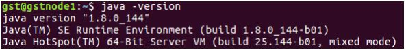
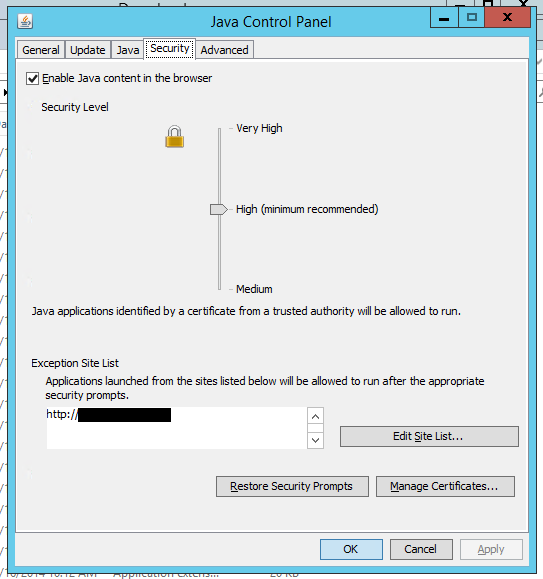

# Java Installation

## 1.ഉബുണ്ടു സിസ്റ്റത്തിൽ ജാവ ഇൻസ്റ്റാൾ ചെയ്യാൻ ജാവ .deb ഫയൽ ഡൗൺലോഡ് ചെയുക 


\#2.ജാവ ഫയൽ ഡൗൺലോഡ് ചെയ്തതിന്‌ ശേഷം ,ഡൗൺലോഡ് ചെയ്ത path ടെർമിനലിൽ ഓപ്പൺ ചെയ്യുക.  
അതിനു ശേഷം [install package](../hastham-gateway/ubuntu-package-installation.md)

ജാവ ഇൻസ്റ്റാൾ ആയെന്നു ഉറപ്പു വരുത്താൻ ടെർമിനലിൽ ഈ കോഡ് ടൈപ്പ് ചെയ്യുക .

```text
java -version
```




If the Java version appears in the terminal, then Java is successfully installed on your system.


**സൈറ്റ് ജാവ സെക്യൂരിറ്റിയിൽ add ചെയുന്ന വിധം\(1\)**


ഇ ഡിസ്ട്രിക്ട് സൈറ്റ് add ചെയ്യുന്നതിന് വേണ്ടി ടെർമിനലിൽ`jcontrol` എന്ന് ടൈപ്പ് ചെയ്യുകയോ അല്ലെങ്കിൽ`/usr /lib /java /jdk /bin` എന്ന path ടെർമിനലിൽ ഓപ്പൺ ചെയുക .തുടർന്ന് `./ControlPanel` എന്ന് ടൈപ്പ് ചെയ്യുക.


```text
jcontrol
```

> OR

```text
cd /usr/lib/java/jdk/bin && ./ControlPanel
```

2.തുടർന്ന് വരുന്ന വിൻഡോയിൽ നിന്ന് സെക്യൂരിറ്റി ടാബ് തിരഞ്ഞെടുക്കുക ,അതിനു ശേഷം edit site തിരഞ്ഞെടുക്കുക, [https://edistrict.kerala.gov.in/](https://edistrict.kerala.gov.in/)add ചെയ്തു കൊടുക്കുക .

```text
https://edistrict.kerala.gov.in/
```


**സൈറ്റ് ജാവ സെക്യൂരിറ്റിയിൽ add ചെയുന്ന വിധം\(2\)**

> 1.Run `sudo /usr/lib/java/jdk....(installed java version driectory name )/jre/bin/jcontrol`

**സൈറ്റ് ജാവ സെക്യൂരിറ്റിയിൽ add ചെയുന്ന വിധം\(3\)**

> 1.Run`sudo /usr/lib/java/jre....(installed java version_name)/bin/jcontrol`

**സൈറ്റ് ജാവ സെക്യൂരിറ്റിയിൽ add ചെയുന്ന വിധം\(windows\)**

`control Panel--->java---->security---->Edit Site List---->Add--->`[**https://edistrict.kerala.gov.in/**](https://edistrict.kerala.gov.in/)---&gt;`OK`



## How to Delete Java Manually

```text
sudo nautilus
```

Go to `Computer--->Usr---->lib--->Java---->move to trash`

##  

