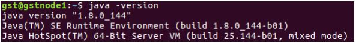

# Java


Type this code into the terminal to confirm that Java is installed.

```
java -version
```




If the Java version appears in the terminal, then Java is successfully installed on your system.


## Java - Adding Sites to Exceptions List

```
jcontrol
```

> OR &#x20;

```
cd /usr/lib/java/jdk/bin && ./ControlPanel
```

#### Java - Adding Sites to Exceptions List**(windows)**

`control Panel--->java---->security---->Edit Site List---->Add--->`[**https://edistrict.kerala.gov.in/**](https://edistrict.kerala.gov.in)--->`OK`


## How to Delete Java Manually

```
sudo nautilus
```

<mark style="color:green;">Go to</mark> <mark style="color:green;"></mark><mark style="color:green;">`Computer--->Usr---->lib--->Java---->move to trash`</mark>

## &#x20;
