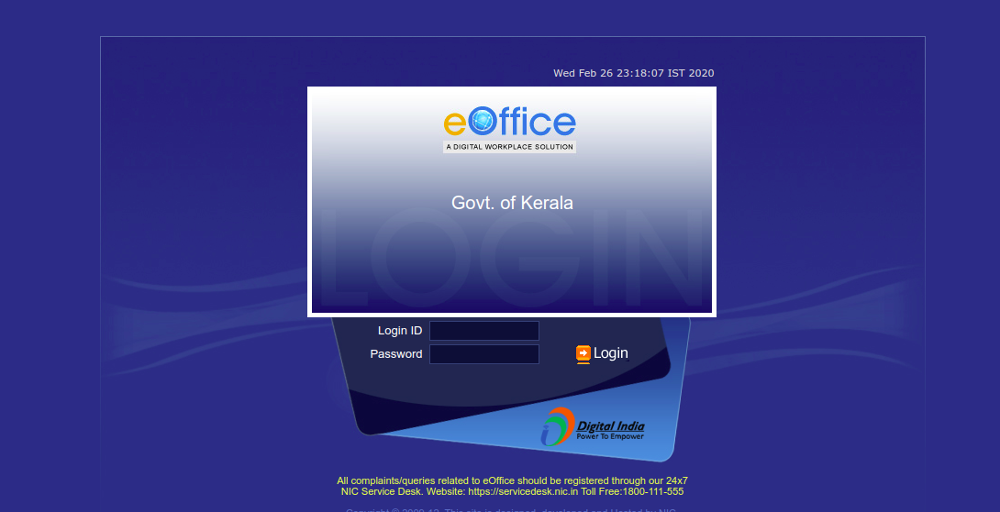

# 2. e-Office(eFile 7.2.0)



## Installation Guidelines for Ubuntu OS


Locate the **Digital\_Signer\_Service-\*\*\*.sh** file from the downloaded bundle (**Digital Signer Service \*.\*.\*** Ubuntu Installer folder,



Go to the downloaded location of **Digital\_Signer\_Service-\*.\*.\*.sh** file and open the terminal.

```
sudo bash Digital_Signer_Service-6.1.3.sh
```

## VPN SETUP

1\)Using SSL Client software Accops(Should be installed on the machine/mobile)&#x20;

&#x20;                                             OR

2\)Use this address to get VPN & eoffice access through public network.\[**Recommend only if client software not working properly]**

```
https://evpn.kerala.gov.in/
```

## [Windows SSL Client Software Accops](https://evpn.kerala.gov.in/fes-bin/public/VPNClientSetup.exe)

## [Ubuntu SSL Client Software Accops](https://evpn.kerala.gov.in/fes-bin/public/HySecure\_Client\_5.1.4.16.deb)

## VPN RESET

```
https://vpnreset.kerala.gov.in/
```

## Eoffice/Email Password Reset

```
https://passapp.email.gov.in/passapp/
```

.gif>)
