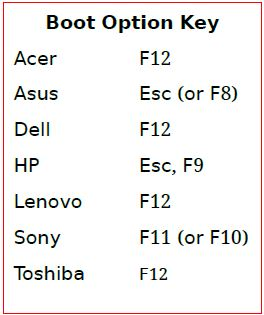
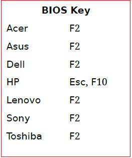

# Ubuntu Corner



**Ubuntu X.YY**

**X-**representing the **year**

**YY** representing the **month of eventual release within in that year**

****



Ubuntu's first release, made in** 2004 October (10th month)** was **Ubuntu 4.10**



Software installation

* GNOME-Software
* Synaptic Package Manager
* GDebi Package Installer
* _apt -_Command Line Tool




## <mark style="color:blue;">ഉബുണ്ടുവിൽ പാക്കേജുകൾ ഇൻസ്റ്റാൾ ചെയ്യുന്ന വിധം</mark>

```shell
sudo apt install <package_name>
```

> Example:To install mplayer

```bash
sudo apt install mplayer
```

## <mark style="color:blue;">**ഉബുണ്ടുവിൽ .deb പാക്കേജുകൾ ഇൻസ്റ്റാൾ ചെയ്യുന്ന വിധം**</mark>

****

```
sudo dpkg -i <file_name.deb>  
```

#### **Folder contain **_**sh**_** file**

```
 sudo ./install.sh
```

>                                                OR

```
 sudo sh install.sh               
```

**Folder contain `setup`file**

```
sudo ./setup
```

## <mark style="color:blue;">**ഉബുണ്ടുവിൽ പാക്കേജുകൾ Uninstall ചെയ്യുന്ന വിധം**</mark>

```
 sudo apt remove <package_name>                         
```

>                                                  OR

```
sudo apt purge <package_name>
```

**To see the details of a package**

```
apt show <package_name>
```

## Install **latest versions of packages and their dependencies**

```
sudo apt-get update
```

```
sudo apt-get -f install
```

## **The command to use as a super user on Ubuntu system**

```
sudo nautilus
```

##  **Guest Removal Ubuntu 16.04**

```
 sudo mkdir /etc/lightdm/lightdm.conf.d
```


```
 sudo sh -c 'printf "[SeatDefaults]\nallow-guest=false\n" > /etc/lightdm/lightdm.conf.d/50-no-guest.conf'
```

`restart system` :signal_strength: 

##  Check Ubuntu Version and Other System Information

```
lsb_release -a
```

## How can I create launchers on my Ubuntu desktop

```
cd usr/share/applications/anydesk.desktop ~/Desktop
```

```
chmod +x ~/Desktop/anydesk.desktop
```

## Important apt Commands

| _apt_ Command  | Function of the command            |
| -------------- | ---------------------------------- |
| apt install    | Installs a package                 |
| apt remove     | Removes a package                  |
| apt purge      | Removes package with configuration |
| apt update     | Refreshes repository index         |
| apt upgrade    | Upgrade all upgradable packages    |
| apt autoremove | Removes unwanted packages          |
| apt search     | Searches for the program           |

## USEFUL LINUX COMMANDS :grin: 

> **system information**

| **command**       | Description                    |
| ----------------- | ------------------------------ |
| date              | show the current date and time |
| uname -a          |  show kernel information       |
| cat /proc/cpuinfo |  cpu information               |
| cat /proc/meminfo | memory information             |
| man command       | show the manual for command    |

## UBUNTU SHORTCUTS :sunglasses: 

| Shortcut | Usage                                       |
| -------- | ------------------------------------------- |
| Ctrl+C   | halts the current command                   |
| Ctrl+Z   | stops the current command                   |
| Ctrl+D   | log out of current session, similar to exit |
| Ctrl+W   | erases one word in the current line         |
| Ctrl+U   | erases the whole line                       |
| Ctrl+R   |  type to bring up a recent command          |
| !!       | repeats the last command                    |
| exit     | log out of current session                  |

## How to Know if Your System Uses MBR or GPT Partitioning on  Linux

```
sudo parted -l
```


 In the output, look for the line starting with **Partition Table**:

 For **MBR**, it would show **msdos**.

 For **GPT**, it would show **gpt**.


## BOOT KEY




## BIOS KEY




