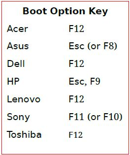
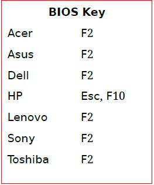

# Ubuntu Corner



**Ubuntu X.YY**

**X-**representing the **year**

**YY** representing the **month of eventual release within in that year**





_The latest LTS version of Ubuntu is_ **Ubuntu 22.04 LTS** _“_[**Jammy Jellyfish**](#user-content-fn-1)[^1]_”_



Ubuntu's first release, made in **2004 October (10th month)** was **Ubuntu 4.10**



Software installation

* GNOME-Software
* Synaptic Package Manager
* GDebi Package Installer
* _apt -_Command Line Tool



#### Install compression Library - Minizip development files


```
sudo apt-get update -y
```

```
sudo apt-get install -y libminizip-dev
```


#### Anydesk wayland not supported  Issue on Ubuntu 22.04 LTS


Please go to this file using Terminal

```shell
sudo gedit /etc/gdm3/custom.conf
```

**Uncomment this line(Remove # from the line)**

<mark style="color:green;">**WaylandEnable=false**</mark>

Reboot your system:bookmark:


## Ubuntu Login Loop Issue


<mark style="color:red;">**Issue:**</mark> When you try to log in to Ubuntu after starting up, you get taken right back around to the same login screen, and the process repeats indefinitely.

<mark style="color:blue;">**Solution:**</mark>

**Step 1:** Press Ctrl + Alt+F3/F4

**Step 2:** Enter Username and Password&#x20;

**Step 3:**

```
sudo nano /etc/gdm3/custom.conf
```

**Step 4:**

**Uncomment this line(Remove # from the line)**

<mark style="color:green;">**AutomaticLoginEnable= true**</mark>     &#x20;

<mark style="color:green;">**AutomaticLogin=user1(Computername)**</mark>

**Step 5:** Ctrl+S to save ,Ctrl+X to exit the file&#x20;

**Step 6:** reboot

## Install **latest versions of packages and their dependencies**

```
sudo apt-get update
```

```
sudo apt-get -f install
```

## **The command to use as a super user on Ubuntu system**

```
sudo nautilus
```

## &#x20;**Guest Removal Ubuntu 16.04**

```
 sudo mkdir /etc/lightdm/lightdm.conf.d
```


```
 sudo sh -c 'printf "[SeatDefaults]\nallow-guest=false\n" > /etc/lightdm/lightdm.conf.d/50-no-guest.conf'
```

`restart system` :signal\_strength:&#x20;

## &#x20;Check Ubuntu Version and Other System Information

```
lsb_release -a
```

## How can I create launchers on my Ubuntu desktop

```
cd usr/share/applications/anydesk.desktop ~/Desktop
```

```
chmod +x ~/Desktop/anydesk.desktop
```

## Important apt Commands

| _<mark style="color:purple;">**apt**</mark>_<mark style="color:purple;">** **</mark><mark style="color:purple;">**Command**</mark> | <mark style="color:purple;">**Function of the command**</mark> |
| ---------------------------------------------------------------------------------------------------------------------------------- | -------------------------------------------------------------- |
| apt install                                                                                                                        | Installs a package                                             |
| apt remove                                                                                                                         | Removes a package                                              |
| apt purge                                                                                                                          | Removes package with configuration                             |
| apt update                                                                                                                         | Refreshes repository index                                     |
| apt upgrade                                                                                                                        | Upgrade all upgradable packages                                |
| apt autoremove                                                                                                                     | Removes unwanted packages                                      |
| apt search                                                                                                                         | Searches for the program                                       |

## USEFUL LINUX COMMANDS :grin:&#x20;

> **system information**

| **command**       | **Description**                |
| ----------------- | ------------------------------ |
| date              | show the current date and time |
| uname -a          |  show kernel information       |
| cat /proc/cpuinfo |  cpu information               |
| cat /proc/meminfo | memory information             |
| man command       | show the manual for command    |

## UBUNTU SHORTCUTS :sunglasses:&#x20;

| **Shortcut** | **Usage**                                   |
| ------------ | ------------------------------------------- |
| Ctrl+C       | halts the current command                   |
| Ctrl+Z       | stops the current command                   |
| Ctrl+D       | log out of current session, similar to exit |
| Ctrl+W       | erases one word in the current line         |
| Ctrl+U       | erases the whole line                       |
| Ctrl+R       |  type to bring up a recent command          |
| !!           | repeats the last command                    |
| exit         | log out of current session                  |

## How to Know if Your System Uses MBR or GPT Partitioning on  Linux

```
sudo parted -l
```


&#x20;In the output, look for the line starting with **Partition Table**:

&#x20;For **MBR**, it would show **msdos**.

&#x20;For **GPT**, it would show **gpt**.


## BOOT KEY




## BIOS KEY




[^1]: 
