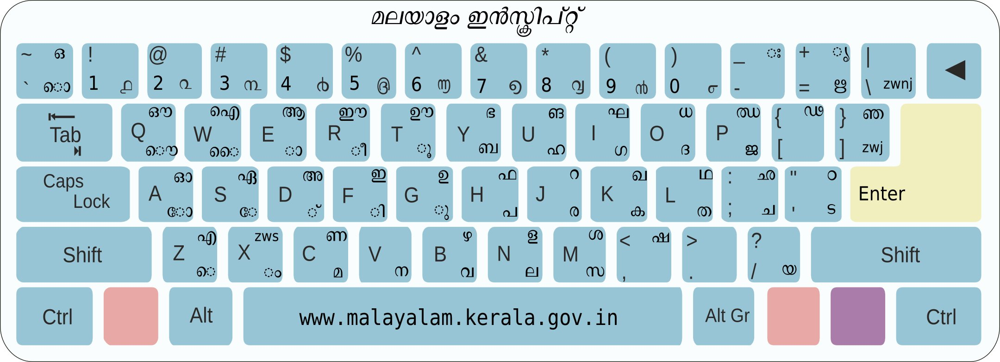
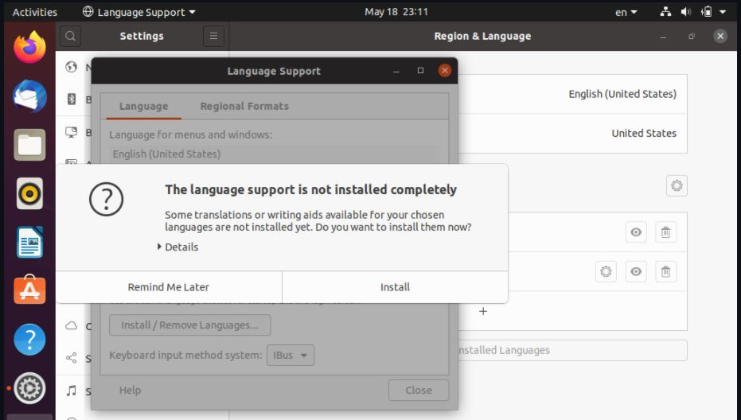

# 6. Malayalam Typing

Swathanthra Malayalam Computing (SMC) is a free software collective engaged in development, localization, standardization and popularization of various **Free and Open Source **Softwares in Malayalam language.





**Malayalam Inscript Typing**:writing\_hand: [malayalm-typing.pdf](https://icfoss.in/doc/malayalam-typing.pdf)

## Government And Unicode

എല്ലാ സർക്കാർ ഓഫീസുകളും യുണീക്കോഡധിഷ്ഠിത മലയാളം ഉപയോഗിക്കണമെന്ന 2008 ലെ സർക്കാർ ഉത്തരവ് [ go.pdf](https://go.lsgkerala.gov.in/files/go20081110\_6255.pdf)

## ചില്ലക്ഷരങ്ങൾ

| ചില്ലക്ഷരങ്ങൾ | ഇൻസ്ക്രിപ്ട്     |
| ------------- | ---------------- |
| **ൻ**         | **V+D+ }**       |
| **ൺ**         | **C+D+ }**       |
| **ൾ**         | **shift+N+D+ }** |
| **ൽ**         | **N+D+ }**       |
| **ർ**         | **J+D+ }**       |

## **വിൻഡോസിൽ ചില്ലക്ഷരം ഉപയോഗിക്കേണ്ട വിധം**

| **ചില്ലക്ഷരം** | **short key**     |
| -------------- | ----------------- |
| **ൾ**          | **SHIFT+8**       |
| **ർ**          | **]**             |
| **ൻ**          | **SHIFT+v**       |
| **ൺ**          | **SHIFT+x**       |
| **ൽ**          | **SHIFT+ .(dot)** |

## ചില്ലക്ഷരം ലഭിക്കാന്‍ എന്ത് ചെയ്യണം?


**ഗ്നു/ലിനക്സ്** ആണ് ഉപയോഗിക്കുന്നതെങ്കില്‍ **അടിസ്ഥാന അക്ഷരവും ചന്ദ്രക്കല പിന്നെ ] **ചേര്‍ന്നാല്‍ ചില്ലക്ഷരം കിട്ടും. ഉദാ: ല ് ] = ല്‍; ന ് ] = ന്‍; ര ് ] = ര്‍&#x20;



**വിന്‍ഡോസാണെങ്കില്‍ ] നു പകരം Ctrl + shift + 1** ഉപയോഗിക്കാം. ഉദാ: ല ് ctrl + shift + 1 = ല്‍&#x20;


#### Zero Width Joiner (ZWJ)


**കീബോര്‍ഡിലെ ]** കീയുടെ സ്ഥാനത്താണ് zwj. ചില്ലക്ഷരങ്ങല്‍ക്കു വേണ്ടിയാണ് ഇത് ഉപയോഗിക്കുന്നത്.

ഉദാ: ല ് ] = ല്‍, ര ് ] = ര്‍, ന ് ] = ന്‍ etc.


#### Zero Width Space (ZWS)


**X കീയുടെ സ്ഥാനത്താണ് zws.** രണ്ട് അക്ഷരങ്ങള്‍ക്കിടയില്‍ അദൃശ്യമായ space വേണമെങ്കില്‍ ഇതുപയോഗിക്കാം.

ഉദാ: ക്ക എന്നത് ക​് ക എന്നെഴുതാന്‍


#### Zero Width Non Joiner (ZWNJ)


&#x20;**\ കീയുടെ സ്ഥാനത്താണ് zwnj. **അടുത്തുവരുന്ന രണ്ട് അക്ഷരങ്ങള്‍ യോജിപ്പിക്കെണ്ടെന്നുണ്ടെങ്കില്‍ ഇതുപയോഗിക്കാം.

ഉദാ: സോഫ്റ്റ്​​വെയര്‍ എന്നെഴുതാന്‍ സോഫ്റ്റ് ന് ശേഷം zwnj ഇല്ലെങ്കില്‍ സോഫ്റ്റ്വെയര്‍ എന്നാകും വരുക.


## MS Word ൽ അക്ഷരങ്ങൾ തമ്മിൽ അകലം


:police\_officer: മലയാളം ഫോണ്ടുകൾ ഉപയോഗിക്കുമ്പോൾ ഇംഗ്ലീഷ് ഉള്ളടക്കം വരുന്നിടത്ത് അക്ഷരങ്ങൾ തമ്മിൽ അനാവശ്യ അകലം വന്നേക്കാം. ഉദാഹരണത്തിന് j എന്ന അക്ഷരത്തിന് മുമ്പ് സ്പേസ് ഇട്ടപോലെ അകലം കാണാം. ഈ പ്രശ്നം വേഡ് 2013 ൽ സാധാരണമാണ്. ഇത് പരിഹരിക്കാൻ വേഡിലെ Kerning എന്ന ഫീച്ചർ ഇനേബിൾ ചെയ്യണം.

&#x20;അതിനായി ഈ [ലേഖനം](https://www.dummies.com/software/microsoft-office/word/how-to-enable-kerning-in-word-2013-documents/) ഉപകരിക്കും.


## ചില്ലുകൾക്ക് പകരം രെജിസ്റ്റേഡ് ചിഹ്നം**®**


:woman\_guard:  2010 ന് മുമ്പ് പുറത്തിറങ്ങിയ രചന, മീര തുടങ്ങിയ ഫോണ്ടുകളിൽ അറ്റോമിക് ചില്ലുകൾക്ക് പകരം വട്ടത്തിനകത്തെ R**(®)** എന്ന രൂപമാണ് കാണുക. അറ്റോമിക് ചില്ലുകൾ വരുന്നതിനു മുമ്പ് പുറത്തിറങ്ങിയ പതിപ്പായതാണ് ഇതിനു കാരണം. ആ ഫോണ്ടുകളുടെ [പുതിയ പതിപ്പുകൾ ഇൻസ്റ്റാൾ ചെയ്താൽ ഈ പ്രശ്നം പരിഹരിക്കാം.](https://smc.org.in/fonts/)


## **Enabling Malayalam language UI in Ubuntu**

Click `Setting` > `Region and Language` >`  Manage installed languages  `.

You can click `Remind me later` Otherwise you can install the additional recommendations and return to this screen.

Now click on `Install/Remove languages` and scroll till you find Malayalam.

Make sure the `Malayalam` is selected. Now click `Apply`. It will ask your password for permission to install language support.

Once it finishes, make sure **`മലയാളം`** is visible in the list as per below.

Now click close, and you should be back at Region and Language screen. Close this screen, and launch `Settings` again, and click on `Region and Languages` > `Languages`.

Select `മലയാളം` in the screen and click on the `Select` button.

This will enable the Malayalam UI. You'd need to restart your session (not the computer itself). Clicking on the restart button will log you out.



:white\_check\_mark: When you log back in, you should see Malayalam user interface.

> 

****
