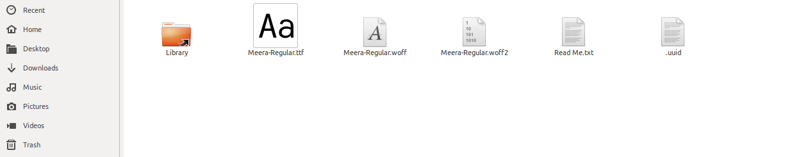

# Font Installation

## Method 1

* &#x20;If you want fonts, go to __ [_https://smc.org.in/fonts_](https://smc.org.in/fonts)__
* download a font from there,double click it and Install.

## Method 2

Make sure that the _**.fonts**_ folder is inside the Home folder, then paste the installed fonts into it, or create a _**.fonts**_ folder inside the Home folder.

> Go to HOME Folder

> Click on **view -> show hidden files** or **ctrl+H** to view hidden files,select **.fonts folder**

paste fonts in that folder


fonts successfully installed on your system :sunglasses:&#x20;

