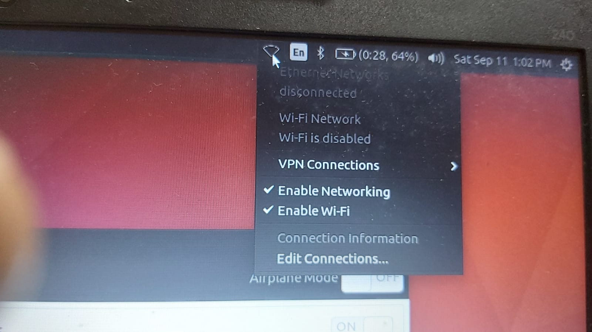

# Wi-Fi


 **Wifi Network not appearing in Ubuntu \[HP\]**



Solution

```text
sudo apt-get install bcmwl-kernel-source 
```

## WiFi not working in HP laptop RTL8723DE Realtek wireless driver


This method is exclusively for RTL8723DE series of wireless adapters. So make sure that you have these adapters by using this command:


```text
sudo lshw -C network
```


If you see a wireless network adapter starting with RTL, then only you should go ahead


```text
sudo apt update
```

```text
sudo apt install git dkms
```

```text
git clone https://github.com/smlinux/rtl8723de.git -b 4.11-up
```

```text
sudo dkms add ./rtl8723de
```

```text
sudo dkms install rtl8723de/5.1.1.8_21285.20171026_COEX20170111-1414
```

```text
sudo depmod -a
```

✅ Reboot 📶 and your wireless should be working. 😀 

**OR TRY THIS**

 **recommend for HP users facing WiFi problem**

```text
sudo apt-get install linux-headers-$(uname -r) build-essential git
```

```text
git clone https://github.com/lwfinger/rtlwifi_new.git
```

```text
cd rtlwifi_new/ && git checkout origin/extended -b extended
```

```text
sudo make install
```

```text
sudo modprobe -r rtl8723de
```

```text
sudo modprobe rtl8723de
```

```text
sudo apt purge bcmwl-kernel-source
```

```text
sudo sed -i '/blacklist bcma/ d' /etc/modprobe.d/blacklist.conf
```

```text
sudo sed -i '/blacklist brcmsmac/ d' /etc/modprobe.d/blacklist.conf
```

```text
sudo modprobe -r rtl8723de && sleep 5 && sudo modprobe rtl8723de ant_sel=1
```

```text
sudo modprobe -r rtl8723de && sleep 5 && sudo modprobe rtl8723de ant_sel=2
```

```text
echo "options rtl8723de ant_sel=X" | sudo tee /etc/modprobe.d/rtl8723de.conf
```

📶 Reboot your PC.

##  Fix no WiFi in Ubuntu with **Broadcom** wireless adapters


This method is exclusively for Broadcom 43 series of wireless adapters. So make sure that you have these adapters by using this command:


```text
sudo lshw -C network
```



If you see a wireless network adapter starting with BCM43, then only you should go ahead .


```text
sudo apt remove broadcom-sta-dkms bcmwl-kernel-source
```

```text
sudo apt install firmware-b43-installer
```


Once the install is finished doing its work, you’ll need to reboot. After you log back in, you’ll be able to see and access your wifi connections. ✅ 


## Ubuntu WiFi is disabled




Simply putting it on `suspend` and bringing it back up seems to make the wifi work normally.**This is not a permanent solution.**The only problem is to do this every time  start Ubuntu.


