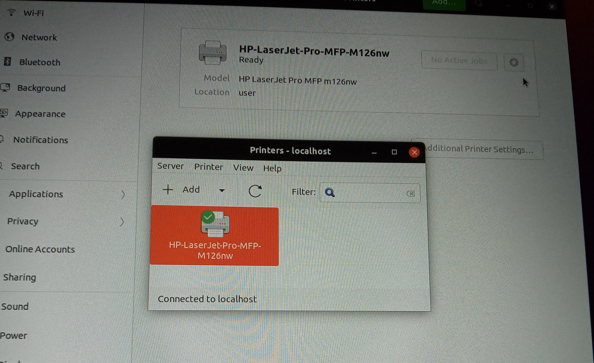

# 7. Printer


## Identify installed printers in  system

```text
lpstat -a
```

**How do I remove hundreds of automatically added network printers**

```text
sudo nautilus
```

> Go to `etc`--&gt;`cups-->cups-browsed.conf`


> stop cups and then remove the printers from the file

```text
sudo service cups-browsed stop
```

## ADDING A NETWORK PRINTER \(UBUNTU\)

> 1. `System Settings --> Printers`
>
> 2.     Click `Add` and select `Find Network Printer`
>
> 3.     Enter the `IP address` in the `Host` field, and click `Find.`
>
> 4.       Click `Forward` and wait while the system searches for drivers
>
> 5.        Click `Apply` to finish

##  HPLIP Driver Installation Process

1.First, download the latest **HPLIP\(HP Linux Imaging and Printing\)** driver from [\[website\]](https://developers.hp.com/hp-linux-imaging-and-printing/gethplip)

2.Secondly: after downloading the file it needs to be made executable. To do this, the following needs to be done:


* Open a terminal
* Browse to the Downloads folder: **`cd Downloads`**
* Then type the following command: **`sudo chmod +x hplip-*.**.**.run`**\(\*.\*\*.\*\* is where the version number of the file needs to be filed in\) ****
* Press Enter and if required, type the _**user password**_ and press Enter

The HPLIP driver is now executable. Keep the terminal open.


 Do not switch on the printer during the installation procedure!!! If the printer is switched on, make sure it is switched off before starting the installation procedure.  


To run the installation file it is not required to use `sudo` to get root privileges. In the terminal type the following command: **`./hplip-.*..run`**


🕵♂ Note that the command **starts with . \(dot\) / \(slash\)** followed by the complete filename and **ending on . \(dot\) run!**


before the installation procedure starts the user must choose whether to install the driver **manually** \(press **c** for **custom**\) or **automatically** \(press **a** for **automatic**\). Best is to execute the installation procedure manually \(custom\) so that every step can be controlled and monitored by the user.

The installation procedure will check for missing ask if older versions of the HPLIP driver must be removed. Confirm that this should be done to avoid any conflicts with older package versions.



💂♀ Always restart the computer, re-plugging in the printer doesn't always work. By restarting the computer and after logging in switching on the printer, the user forces Ubuntu to search for any printers connected.




> ✅ HPLIP Driver installed Successfully

