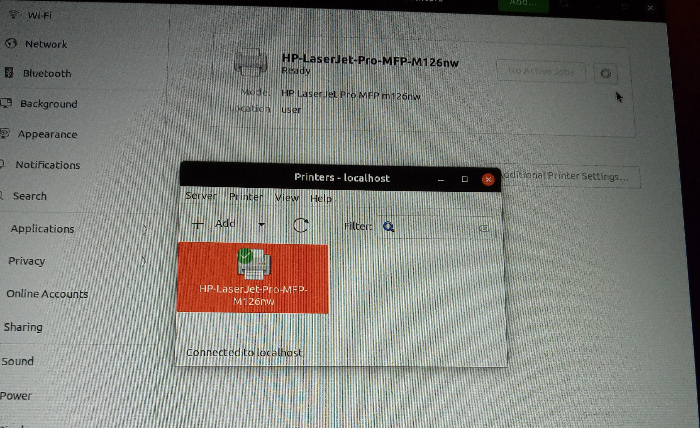
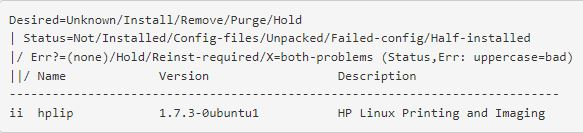

# 7. Printer

## Identify installed printers in  system

```
lpstat -a
```

## **How do I remove hundreds of automatically added network printers**

```
sudo nautilus
```

> 1.Go to `etc`-->`cups-->cups-browsed.conf`

&#x20;2.Change this line: `BrowseRemoteProtocols dnssd cups` (or whaterver is after   it) to none so it reads: `BrowseRemoteProtocols none`


> 3.stop cups and then remove the printers from the file

```
sudo service cups-browsed stop
```

## ADDING A NETWORK PRINTER (UBUNTU)

> &#x20;1.`System Settings --> Printers`
>
> 2\. Click `Add` and select `Find Network Printer`
>
> 3\. Enter the `IP address` in the `Host` field, and click `Find.`
>
> 4\. Click `Forward` and wait while the system searches for drivers
>
> 5\. Click `Apply` to finish

## HPLIP Driver Installation Process


Do not switch on the printer during the installation procedure!!! If the printer is switched on, make sure it is switched off before starting the installation procedure.


First, Go to all applications menu, search and open "**Software & Update**",\
Change the download server from **"Server in India" to "Main Server"**

1. **`sudo su`** (Click Enter Button) (Enter Password if Prompted)
2. **`apt-get update`** (Click Enter Button) (Wait for Update to complete)
3. **`apt-get -f install`** (Click Enter Button) (If there is any Dependency package issue this command will prompt to clear it)
4. **`apt-get remove --purge ippusbxd`** (Click Enter Button) (This command will remove the ippusbxd package that sometimes causes scanning issues for Multi-function Printers in Ubuntu) (You will be prompted to remove it or not with Yes or No)
5. **`exit`** (Click Enter Button)
6. download the latest **HPLIP(HP Linux Imaging and Printing)** driver from [\[website\]](https://developers.hp.com/hp-linux-imaging-and-printing/gethplip)
7. After downloading the file it needs to be made executable. To do this, the following needs to be done:
8. Open a terminal
9. Browse to the Downloads folder: **`cd Downloads`**
10. Then type the following command: **`sudo chmod +x hplip-*.**.**.run`**(\*.\*\*.\*\* is where the version number of the file needs to be filed in)

* [x] Press Enter and if required, type the _**user password**_ and press Enter

The HPLIP driver is now executable. Keep the terminal open.

11. **`/hplip-.*..run`**


&#x20;Do not switch on the printer during the installation procedure!!! If the printer is switched on, make sure it is switched off before starting the installation procedure.<br>


before the installation procedure starts the user must choose whether to install the driver **manually** (press **c** for **custom**) or **automatically** (press **a** for **automatic**). Best is to execute the installation procedure manually (custom) so that every step can be controlled and monitored by the user.

The installation procedure will check for missing ask if older versions of the HPLIP driver must be removed. Confirm that this should be done to avoid any conflicts with older package versions.



:woman\_guard: Always restart the computer, re-plugging in the printer doesn't always work. By restarting the computer and after logging in switching on the printer, the user forces Ubuntu to search for any printers connected.




> :white\_check\_mark: HPLIP Driver installed Successfully

## Is HPLIP currently installed?

**Debian package based distributions (Debian, Ubuntu, Mepis, etc):**

Run in a terminal window:

```
dpkg -l hplip
```

You may see something that looks like this:




If you see "ii" in the first column before "hplip", then HPLIP is already installed. If you want to use the currently installed version of HPLIP, try running `hp-setup` in a terminal shell.


**my HP printer supported by HPLIP please\[** [**check here**](https://developers.hp.com/hp-linux-imaging-and-printing/supported_devices/index?language=es)**]**



**HP Printer Installtion(Method 2)**

```bash
sudo apt update  
sudo apt upgrade
sudo apt install hplip hplip-gui  
hp-setup   
```

For the scanner to work, you may need to restart the scanning service.

```bash
sudo systemctl restart saned
```

