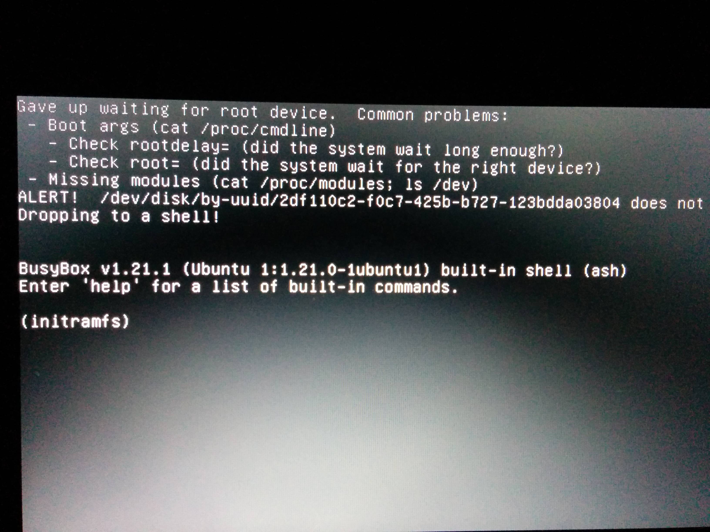
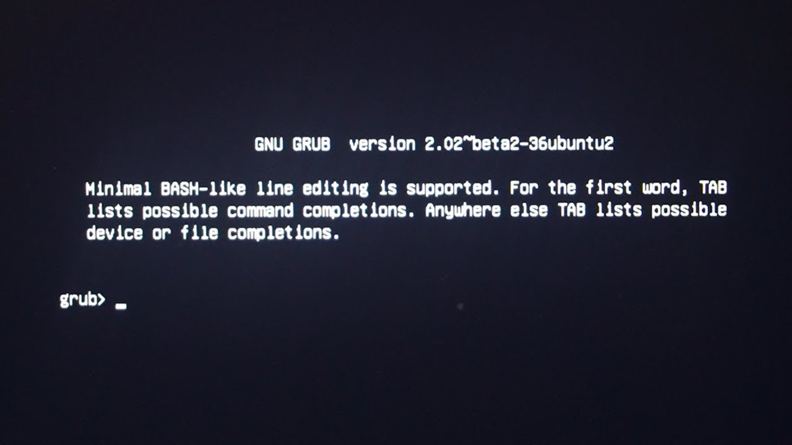
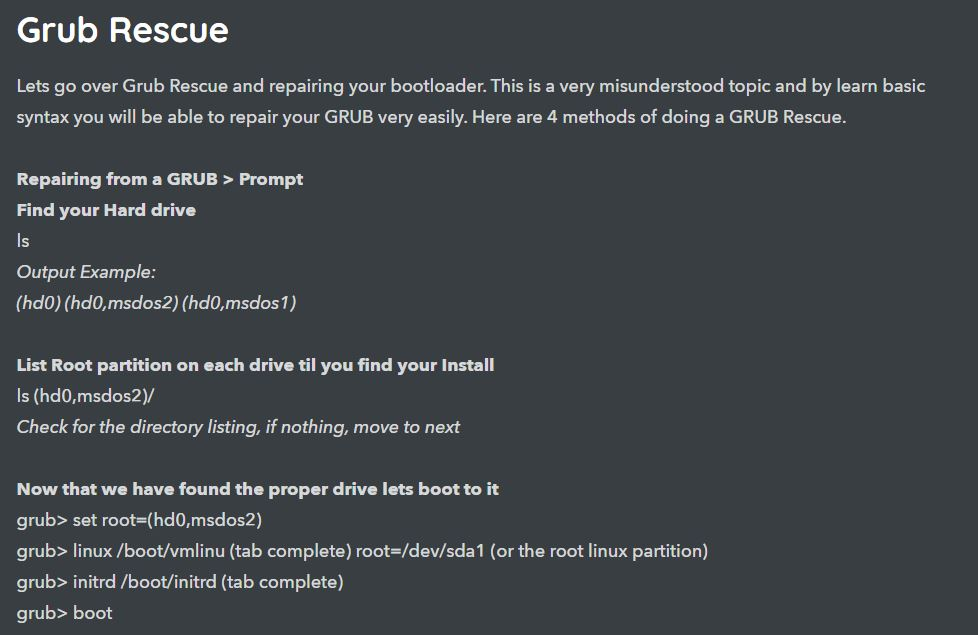
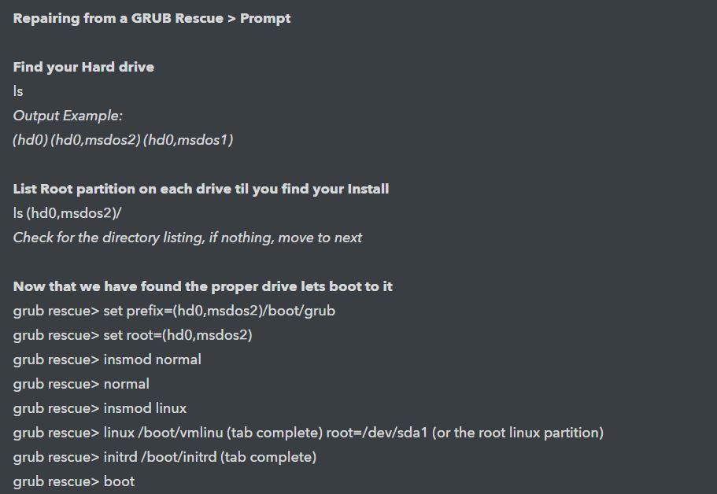

# 5. Issues and Solutions



**1**.Initramfs Issue BusyBox /fsck error




> solution

```
fsck /dev/sdaX
```

&#x20;`/dev/sda1` is the first partition of first drive. X- partition

```
reboot
```

If you don't want to manually press 'y' every time it asks for a fix, you can also run the command with the `-y` option.

```
fsck /dev/sdaX -y
```


Error that occurred due to improper shutdown or Partial upgrades(**fsck**-**F**ile**S**ystem **C**hec**k)**



**2**.failed to start nvidia persistence daemon



solution: first restart your system. then select `ubuntu` from GRUB menu. then press the `E` key. Add `nouveau.modeset=0` to the end of the `linux` line - press `F10` to boot.


&#x20;`nomodeset` is a temporary solution in case a system does not boot without a proprietary driver. This is not to be used permanently.



**3**.Date and Time setting


> Solution


```
sudo date 010224311971.59
```

> OR

```
sudo date --set="2020-01-02 23:31:5
```


**4.GRUB RESCUE ISSUE**




> **solution:1**
>
> `grub>`**`set`**
>
> for Example:
>
> `root=hd0,msd0s7(output of`` `**`set`**`)this may change`
>
> `................................................`
>
> `grub rescue>set boot=(hd0,msd0s7)`
>
> `grub rescue>set prefix=(hd0,msd0s7)/boot/grub`
>
> `grub rescue>insmod normal`
>
> `grub rescue>normal`
>
> #### `Then login to ubuntu update Grub`
>
> &#x20;``&#x20;

```
sudo update-grub
```

```
sudo grub-install /dev/sda
```

**METHOD 1:**



**2**



**3**


OTHER LINKS:[<mark style="color:orange;background-color:purple;">GRUB RESCUE</mark>](https://www.pcsuggest.com/grub-rescue-linux/)<mark style="color:orange;background-color:purple;">1</mark>&#x20;

[<mark style="background-color:purple;">GRUB RESCUE LINK2</mark>](https://itsfoss.com/fix-minimal-bash-line-editing-supported-grub-error-linux/)<mark style="background-color:purple;"></mark>


## How do I change the user account password?

```
passwd
```

## To change other users password:

```
sudo passwd USERNAME
```
