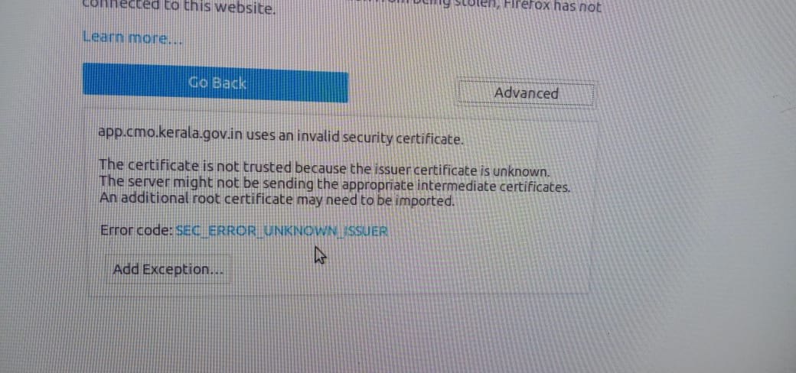
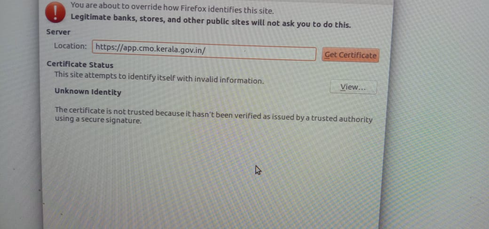
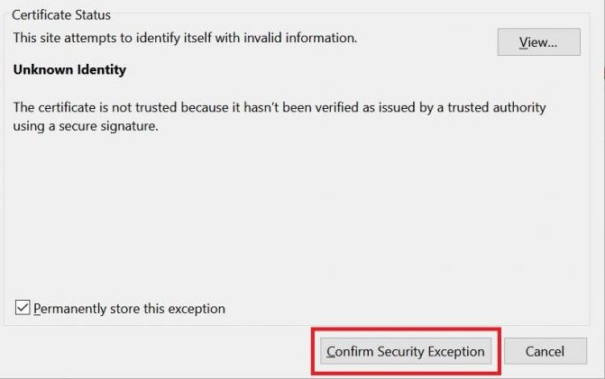

# 4. Issues and Solutions



Initramfs Issue BusyBox 



> solution

```text
fsck /dev/sda1
```

 `/dev/sda1` is the first partition of first drive. **sda**  may change

```text
reboot
```


Date and Time setting


> Solution


```text
sudo date 010224311971.59
```

> OR

```text
sudo date --set="2020-01-02 23:31:5
```


Minimal bash like Line editing is supported/GRUB Issue



> solution:


**Did not find a connection with UUID '\(null\)'**


soln:

```text
sudo systemctl stop NetworkManager.service
```

```text
sudo systemctl start NetworkManager.service
```


problem solved



Your Connection is not secure 


> problem


> solution

click **`Advanced`** option



click **`Add Exception`** option





✅ success


Error editing connection:Did not find a connection with UUID '\(null\)'


solution:

```text
sudo systemctl stop NetworkManager.service
```

```text
sudo systemctl start NetworkManager.service
```

How do I change the user account password?

```text
passwd
```

To change other users password:

```text
sudo passwd USERNAME
```

