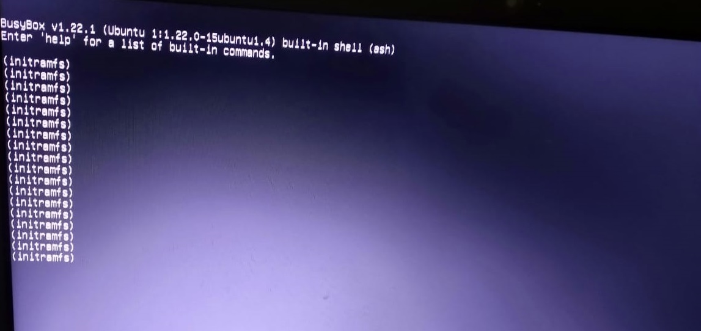
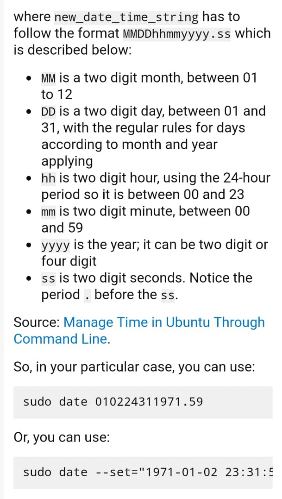
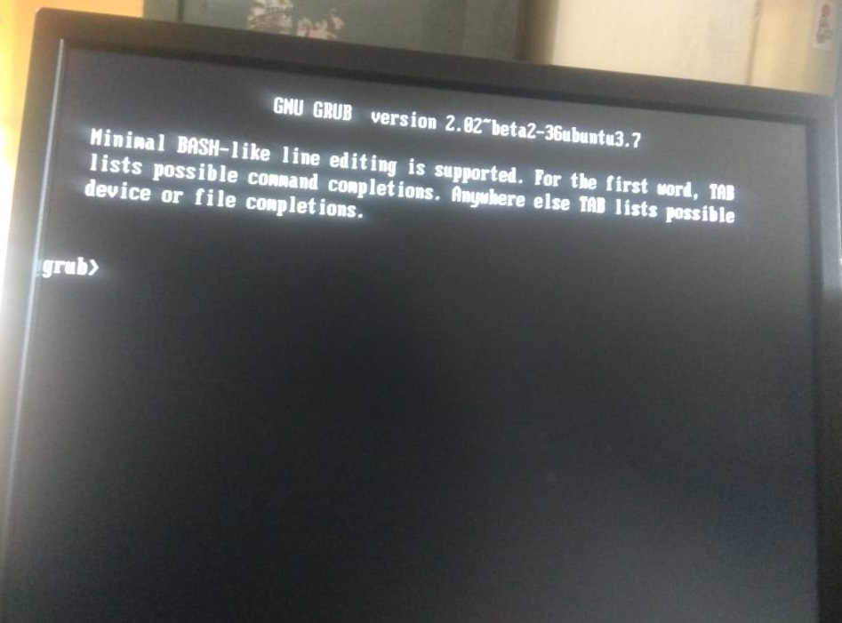

# 5. Issues and Solutions



**1**.Initramfs Issue BusyBox /fsck error




> solution

```text
fsck /dev/sdaX
```

 `/dev/sda1` is the first partition of first drive. X- partition

```text
reboot
```


**2**.failed to start nvidia persistence daemon



solution: first restart your system. then select `ubuntu` from GRUB menu. then press the `E` key. Add `nouveau.modeset=0` to the end of the `linux` line - press `F10` to boot.


 `nomodeset` is a temporary solution in case a system does not boot without a proprietary driver. This is not to be used permanently.



**3**.Date and Time setting


> Solution



```text
sudo date 010224311971.59
```

> OR

```text
sudo date --set="2020-01-02 23:31:5
```


**4.**Minimal bash like Line editing is supported/GRUB Issue




> solution:
>
> `grub>set`
>
> for Example:
>
> `root=hd0,msd0s7(output ofset)this may change`
>
> `grub rescue>set boot=(hd0,msd0s7)`
>
> `grub rescue>set prefix=(hd0,msd0s7)/boot/grub`
>
> `grub rescue>insmod normal`
>
> `grub rescue>normal`
>
> ✅ Success/ otherwise please change O.S \(better option\) 😇


**5.**Error editing connection:Did not find a connection with UUID '\(null\)'


solution:

```text
sudo systemctl stop NetworkManager.service
```

```text
sudo systemctl start NetworkManager.service
```

How do I change the user account password?

```text
passwd
```

To change other users password:

```text
sudo passwd USERNAME
```

