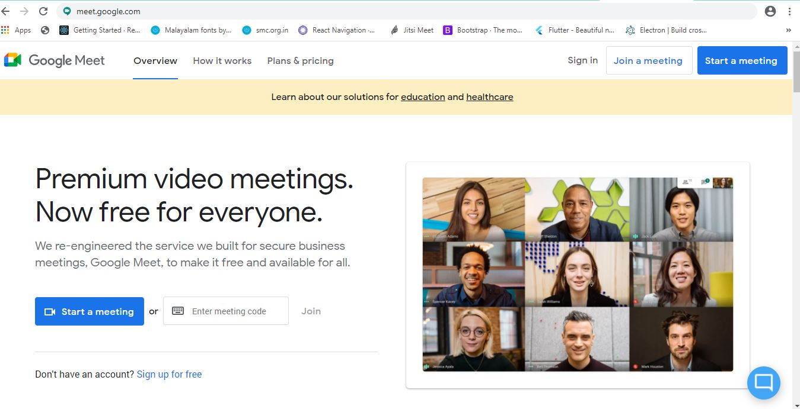
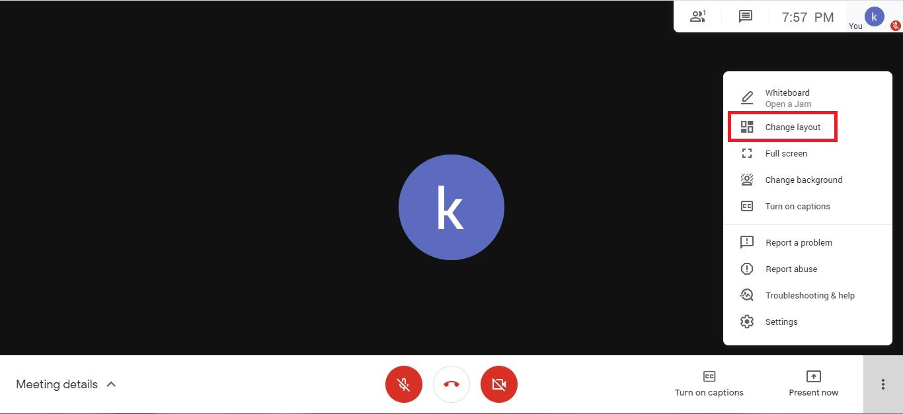
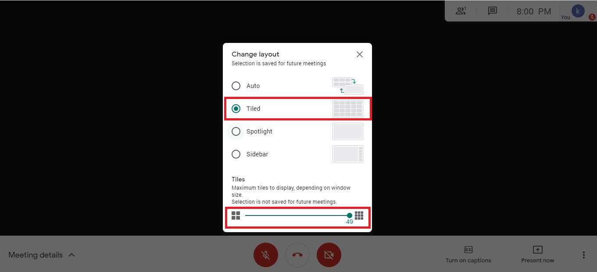
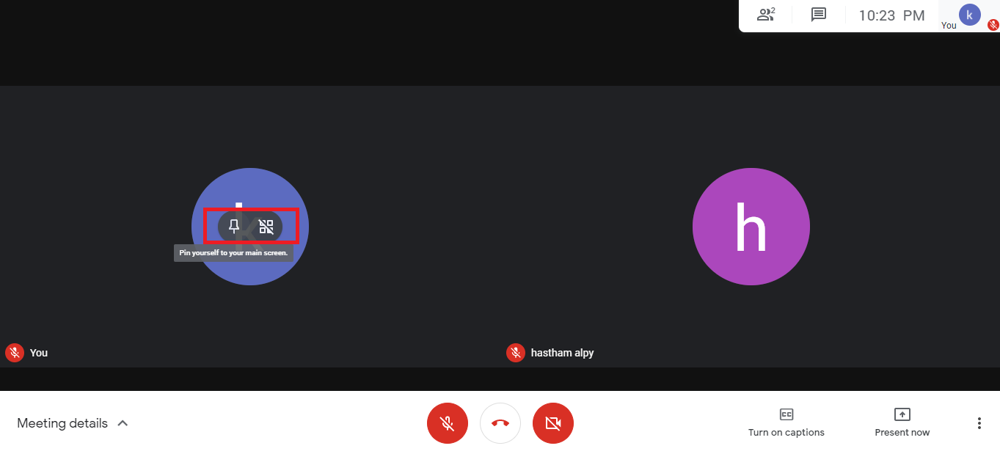

# Google meet

## How to join Google meet&#x20;

> Enter the meeting code in the place given

## Learn about the New Meet Layout (

## Change layout in google meet

> Select **change Layout**

> Select **Tiled **option from layout

> increase the tile size depending on the window size  to view more participant in screen.

## How to** pin** the screen

